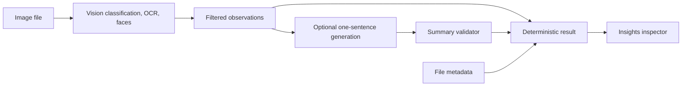

# StillView app and AI insights review

Reviewed September 5, 2026, against `feat/before-after-slider` at `74e7b83` (version 4.5.0, build 34). Review only: application behavior and Xcode project files were not changed.

StillView has a useful native Studio structure and a defensible local AI architecture. The highest-value work is to make image inspection trustworthy, make Insights accessible on first use, and turn its observations into useful output. Preserve Single/Strip/Grid and the Info/Insights inspector; prioritize correctness over a broad visual redesign.

## Evidence and limits

- Read the active app, image loading, folders, caches, bookmarks, keyboard commands, preferences, inspector, AI pipeline, test target, and CI configuration. Three parallel reviews covered AI, core reliability, and usability.
- Built and tested the current checkout with Xcode 26.6 and the macOS 26.5 SDK on macOS 26.6.2. **55 tests passed, zero failures.** Only eight of the 67 Swift files in the test directory are included in the active test target; this is not broad regression coverage.
- SwiftLint completed with **seven warnings, zero serious violations** using `--no-cache`. The first cached lint attempt failed writing its cache. The first sandboxed Xcode attempt failed to launch compiler macro plug-ins; the authorized retry outside the sandbox passed.
- Launched the fresh build from `/tmp/stillview-review-derived/Build/Products/Debug/StillView - Simple Image Viewer.app`. Inspected light-mode welcome, Single, Strip, Grid, Info, the default-disabled Insights entry, Fit/100%/200%, pan, keyboard navigation, Open Folder, and a roughly 900-point-wide window using repository sample photos.
- Focused Swift probes reproduced AI task-state races, validator acceptance defects, short-text contradictions, orientation loss, ineffective downsampling, and cache accounting errors. These are logic/API reproductions; invented validator inputs are not claims about actual generated model responses.
- Ran the current production perception/generation/validation code against four repository photos and a synthetic STOP image, using a standalone Swift executable with file/logger stubs and stdout instrumentation. Apple Intelligence was available. Actual model output and final results are preserved in [live AI evidence](/Users/vinnycarpenter/Projects/SimpleImageViewer/docs/reviews/2026-09-05-ai-live-evidence.txt). This is a five-image smoke evaluation, not a representative accuracy benchmark or signed-app test.
- No destructive Trash operation was exercised. Full VoiceOver navigation, dark/high-contrast appearance, multi-window behavior, long-session memory profiling, removable-drive recovery, signing/App Store behavior, and live CI status remain unverified.

Local build evidence: [test log](/tmp/stillview-review-xcodebuild-retry.log), [test result bundle](/tmp/stillview-review-tests-retry.xcresult), [lint log](/tmp/stillview-review-swiftlint-nocache.log).

## Highest-priority engineering findings

P1 means repair before relying on the affected core workflow. P2 means a concrete defect or substantial limitation to schedule next. Source findings are distinguished from runtime or probe reproductions.

| Priority | Finding and evidence | Recommended repair and acceptance check |
| --- | --- | --- |
| P1 | **The displayed image can belong to the previous selection.** The viewer cancels loading for the newly selected URL, retains prior subscriptions, and publishes every completion without comparing it with the current selection. Enhanced processing has the same problem. Source: [ImageViewerViewModel.swift:536](</Users/vinnycarpenter/Projects/SimpleImageViewer/StillView - Simple Image Viewer/ViewModels/ImageViewerViewModel.swift:536>), [completion:578](</Users/vinnycarpenter/Projects/SimpleImageViewer/StillView - Simple Image Viewer/ViewModels/ImageViewerViewModel.swift:578>). | Own a single cancellable load with a selection ID. Gate image, loading state, errors, expected dimensions, and enhancement results by that ID. Test slow A → cached B → A completes; B must remain displayed with B's metadata and insight. |
| P1 | **EXIF orientation is lost in the main-image decoder.** The decoder wraps the raw CGImage without applying its orientation, while Vision receives orientation correctly. Probe: an orientation-6 JPEG with raw dimensions 80×40 stays 80×40 in the viewer path; orientation-aware decode yields 40×80. [ImageLoaderService.swift:207](</Users/vinnycarpenter/Projects/SimpleImageViewer/StillView - Simple Image Viewer/Services/ImageLoaderService.swift:207>). | Share an orientation-aware decode contract across stage, thumbnails, and AI. Test all eight EXIF orientations with an asymmetric fixture. This also prevents the app and AI from analyzing visibly different presentations. |
| P1 | **Fit and Actual Size are the same transform.** Runtime: pressing `1` changed Fit to 100% without changing a 3200×2000 image's displayed size. The view first fits the image, then scales it; both commands use scale 1. [EnhancedImageDisplayView.swift:82](</Users/vinnycarpenter/Projects/SimpleImageViewer/StillView - Simple Image Viewer/Views/EnhancedImageDisplayView.swift:82>), [ImageViewerViewModel.swift:258](</Users/vinnycarpenter/Projects/SimpleImageViewer/StillView - Simple Image Viewer/ViewModels/ImageViewerViewModel.swift:258>). | Define one image-to-viewport transform. Derive Fit from viewport size, and define 100% explicitly in image pixels versus display backing pixels. Test large and small images, Retina backing scale, and inspector resizing. |
| P1 | **Pan is discarded when the gesture ends.** Runtime at 200%: dragging returns the image to the same centered crop. Pinch also maintains a separate starting scale that can diverge from toolbar zoom. [EnhancedImageDisplayView.swift:172](</Users/vinnycarpenter/Projects/SimpleImageViewer/StillView - Simple Image Viewer/Views/EnhancedImageDisplayView.swift:172>). | Accumulate pan, clamp bounds, and use the current zoom as the gesture baseline. Reset on image change or Fit. A corner must remain visible after releasing the mouse. |
| P1 | **Corrupt-file recovery can loop indefinitely.** Each decode failure creates a fresh retry count, while the validity check only checks file existence. Two existing corrupt files can bounce between one another. [ImageViewerViewModel.swift:713](</Users/vinnycarpenter/Projects/SimpleImageViewer/StillView - Simple Image Viewer/ViewModels/ImageViewerViewModel.swift:713>). | Track failed URLs within one bounded recovery session; stop with a visible error and manual navigation when exhausted. Test two corrupt files and a valid file followed by two corrupt files. |
| P1 | **Core tests are present on disk but absent from the active target.** Navigation, decoder, cache, folder, restoration, and eval-harness suites are excluded. [project.pbxproj:706](</Users/vinnycarpenter/Projects/SimpleImageViewer/StillView - Simple Image Viewer.xcodeproj/project.pbxproj:706>). | Restore membership through Xcode, update dormant tests that no longer compile, and make the critical regression suites run in CI. Do not equate 55 passing tests with coverage of the whole app. |
| P2 | **Trash completion reconciles the wrong identity.** It recycles a captured URL but removes the then-current index; changing selection or folder before completion can remove another item from the visible list. Scoped access also ends before the asynchronous callback. Source only; no deletion performed. [ImageViewerViewModel.swift:1001](</Users/vinnycarpenter/Projects/SimpleImageViewer/StillView - Simple Image Viewer/ViewModels/ImageViewerViewModel.swift:1001>), [list update:1074](</Users/vinnycarpenter/Projects/SimpleImageViewer/StillView - Simple Image Viewer/ViewModels/ImageViewerViewModel.swift:1074>). | Capture folder and deleted URL, retain scoped access through completion, and reconcile by URL. Test callback completion after navigation using an injected recycler and disposable fixtures. |
| P2 | **Cache usage grows after entries are evicted.** The delegate asynchronously searches for an object after NSCache has removed it. Probe: one retained entry is accounted as two. Load/unload paths also use inconsistent compressed versus decoded costs. [ImageCache.swift:195](</Users/vinnycarpenter/Projects/SimpleImageViewer/StillView - Simple Image Viewer/Models/ImageCache.swift:195>). | Store URL and exact decoded-byte cost with each cache entry; release that same cost once on removal or eviction. Exercise repeated eviction, replacement, purge, and reload; reconcile to retained bytes. |
| P2 | **Large-image downsampling is ineffective.** Thumbnail options are passed to `CGImageSourceCreateImageAtIndex`. Probe: requesting max size 40 still returns 180×90; `CreateThumbnailAtIndex` gives 40×20. [ImageLoaderService.swift:202](</Users/vinnycarpenter/Projects/SimpleImageViewer/StillView - Simple Image Viewer/Services/ImageLoaderService.swift:202>). | Use the thumbnail API for bounded previews and budget from pixel dimensions/decoded bytes. Decode full detail when the viewport needs it. A compressed-file-size threshold is not a reliable bitmap memory budget. |
| P2 | **Session restoration never starts scanning.** It sets `selectedFolderURL`, waits 0.5 seconds, then checks content that was never requested. [ContentView.swift:318](</Users/vinnycarpenter/Projects/SimpleImageViewer/StillView - Simple Image Viewer/App/ContentView.swift:318>). | Resolve bookmark → await scan → select saved URL → restore viewport. Remove the fixed delay. Test cold launch, slow storage, missing selection, and unavailable folder. |
| P2 | **Recent-folder/bookmark associations have incompatible persistence formats.** One service writes unordered dictionary values; the picker assumes bookmark and URL arrays are aligned by index. [SecurityScopedBookmarkManager.swift:253](</Users/vinnycarpenter/Projects/SimpleImageViewer/StillView - Simple Image Viewer/Services/SecurityScopedBookmarkManager.swift:253>), [FolderSelectionViewModel.swift:207](</Users/vinnycarpenter/Projects/SimpleImageViewer/StillView - Simple Image Viewer/ViewModels/FolderSelectionViewModel.swift:207>). | Persist each recent folder as one record containing its bookmark. Migrate old records and retain unavailable folders with a relink action. Test stale bookmarks and multiple folders across relaunch. |
| P2 | **Folder monitoring is unused.** The monitor exists but has no production caller. External additions, deletions, and replacements therefore do not refresh the active folder. [FileSystemService.swift](</Users/vinnycarpenter/Projects/SimpleImageViewer/StillView - Simple Image Viewer/Services/FileSystemService.swift>). | Own one active-folder monitor, reconcile by URL, invalidate changed image/thumbnail/insight entries, and cancel on folder switch. |

## AI: what the current implementation actually does

The current implementation is more conservative than portions of `CLAUDE.md`. It uses Vision classification, OCR, and face rectangles; gates evidence; optionally asks Foundation Models for one cautious sentence; validates that sentence; and builds titles, details, tags, and limitations deterministically. File names, embedded descriptions/keywords, EXIF, and GPS do not enter the current prompt. There is no active saliency/horizon narrative path.

The descriptive ceiling is the observations available to the language model. Prompt changes cannot recover colors, composition, relationships, or objects that the perception stage never supplied. Keep the current local privacy boundary and strengthen usefulness and evidence handling before increasing narrative ambition.

The live smoke evaluation exposed both avoidable category selection and unsupported narrative relationships:

| Image | Current title | Actual result | What should improve |
| --- | --- | --- | --- |
| Brick alley | Path | “A path runs through an alley in an outdoor land area.” | Prefer the more informative alley label over the nearly tied path label; remove redundant generic context. |
| Raspberries | Berry | “There is a berry on the table.” | Raspberry was available at the same score. The table relationship was absent from the supplied observations, even if plausible from the photograph. |
| Forest waterfall | Liquid | “There is a water body with a waterfall on land.” | Waterfall scored about 89%, almost identical to liquid; use the specific meaningful category. |
| City from above | Structure | “There is a skyscraper with a liquid on top of it, and it is on a land area.” | Reject the invented spatial relationship. Classification labels alone do not locate objects relative to each other. |
| Synthetic STOP text | No reliable visual match | Says no readable text was found, while useful details contain “Recognized text: STOP”. | Preserve successful short-text recognition regardless of the narrative-generation gate. |

Individual observed runs took 0.208–1.940 seconds. These five timings are not median/p95 estimates. The model's output may change across OS updates; retain the fixtures and assert factual properties rather than exact sentence wording.

| Priority | AI finding | Improvement and verification |
| --- | --- | --- |
| P1 usability | **Fresh users cannot enter Insights from its visible tab.** Runtime: clicking Insights leaves Info selected. `enableAIAnalysis` defaults false; selecting the tab calls availability refresh, which forces it back to Info. [PreferencesService.swift:263](</Users/vinnycarpenter/Projects/SimpleImageViewer/StillView - Simple Image Viewer/Services/PreferencesService.swift:263>), [ImageViewerViewModel.swift:350](</Users/vinnycarpenter/Projects/SimpleImageViewer/StillView - Simple Image Viewer/ViewModels/ImageViewerViewModel.swift:350>). | Keep the tab open and show a clear opt-in state: what it does, on-device privacy, and an Enable Insights action. Distinguish app preference off, Apple Intelligence off, unsupported device, and model preparing. Test fresh defaults and every availability reason. |
| P2 usefulness | **Generic taxonomy parents win the title and consume evidence slots.** Live titles include Liquid and Structure despite waterfall and skyscraper labels at similar scores. The classifier takes the first four non-scene categories and the result builder selects the first. [ImageContentTypeClassifier.swift:57](</Users/vinnycarpenter/Projects/SimpleImageViewer/StillView - Simple Image Viewer/Services/ImageContentTypeClassifier.swift:57>), [ImageInsightCore.swift:257](</Users/vinnycarpenter/Projects/SimpleImageViewer/StillView - Simple Image Viewer/Models/ImageInsightCore.swift:257>). | Add a small documented specificity policy; demote generic material/structure/liquid concepts, collapse related labels, and select meaningful supported subjects before truncation. Test waterfall versus liquid, raspberry versus food/fruit/berry, and skyscraper versus structure. Do not prefer a speculative fine-grained label without sufficient evidence. |
| P2 accuracy | **Token overlap is not factual grounding.** With only `sports_car: 0.88`, the validator accepts “A sports car has leather seats and damaged tires.” It also accepts “Ferrari sports car appears in the image.” The first-word proper-noun exemption enables the second example. [InsightOutputValidator.swift:24](</Users/vinnycarpenter/Projects/SimpleImageViewer/StillView - Simple Image Viewer/Services/InsightOutputValidator.swift:24>), [proper nouns:66](</Users/vinnycarpenter/Projects/SimpleImageViewer/StillView - Simple Image Viewer/Services/InsightOutputValidator.swift:66>). | For the macOS 26 path, compose summaries from allowed evidence or constrain generation to selecting evidence IDs/approved phrases. Do not keep expanding a denylist and call it grounded. Add negative assertions for unsupported objects, attributes, identities, relationships, and activities. These examples are validator probes, not observed model hallucinations. |
| P2 accuracy | **Recognized text does not constrain quoted text or numbers.** Given “Invoice 4021” and “Total due 58 dollars”, the validator accepts “The invoice says \"transfer 9000 dollars immediately\".” [InsightOutputValidator.swift:31](</Users/vinnycarpenter/Projects/SimpleImageViewer/StillView - Simple Image Viewer/Services/InsightOutputValidator.swift:31>). | Present literal OCR separately. Require every quoted span and numeric value to match actual OCR evidence. Treat OCR as untrusted data and keep instruction-like image text out of behavioral instructions. |
| P2 accuracy | **Short/CJK OCR contradicts the fallback.** `STOP` or `東京駅` alone routes to unknown because text dominance requires four tokens. The summary says no readable text while details show the recognized text. [ImageContentTypeClassifier.swift:49](</Users/vinnycarpenter/Projects/SimpleImageViewer/StillView - Simple Image Viewer/Services/ImageContentTypeClassifier.swift:49>), [ImageInsightCore.swift:283](</Users/vinnycarpenter/Projects/SimpleImageViewer/StillView - Simple Image Viewer/Models/ImageInsightCore.swift:283>). | Separate text existence from text dominance. Use language-aware segmentation and OCR area/layout for dominance, retaining short text as a valid observation. Test STOP, CJK signs, single words, numbers, and text over a photo. |
| P2 lifecycle | **Old canceled work can clear newer work.** An older task's catch block resets shared state and clears `generationTask` without identity checks. A controlled probe starts B, completes canceled A, observes idle, then finds Cancel cannot prevent B's result. [ImageInsightViewModel.swift:67](</Users/vinnycarpenter/Projects/SimpleImageViewer/StillView - Simple Image Viewer/ViewModels/ImageInsightViewModel.swift:67>). | Assign a generation ID; require it before every success, error, cancellation, and task-handle mutation. Test controlled out-of-order completion and noncooperative cancellation. |
| P2 lifecycle | **Results are reset on app activation and inspector re-entry.** Preparation cancels and clears state even for the same image. [ImageViewerViewModel.swift:143](</Users/vinnycarpenter/Projects/SimpleImageViewer/StillView - Simple Image Viewer/ViewModels/ImageViewerViewModel.swift:143>), [ImageInsightViewModel.swift:20](</Users/vinnycarpenter/Projects/SimpleImageViewer/StillView - Simple Image Viewer/ViewModels/ImageInsightViewModel.swift:20>). | Refresh availability separately from selection. Preserve the last result and add a bounded in-memory cache keyed by stable file identity/modification, pipeline version, and relevant model/OS version. Invalidate when the file changes. |
| P2 recovery | **Decode and Vision failures look like successful weak analysis.** Both return empty evidence. [ImagePerceptionService.swift:82](</Users/vinnycarpenter/Projects/SimpleImageViewer/StillView - Simple Image Viewer/Services/ImagePerceptionService.swift:82>), [request failure:127](</Users/vinnycarpenter/Projects/SimpleImageViewer/StillView - Simple Image Viewer/Services/ImagePerceptionService.swift:127>). | Return typed access/decode/request errors and preserve successful partial observations. “Could not read this image” needs Retry or reselect access; “No confident subject match” is a different outcome. |
| P2 performance | **Cancel does not cancel the detached Vision work, and analysis decodes full resolution.** [ImagePerceptionService.swift:80](</Users/vinnycarpenter/Projects/SimpleImageViewer/StillView - Simple Image Viewer/Services/ImagePerceptionService.swift:80>). | Bound concurrent work and decoded dimensions, propagate cancellation to requests, and check between stages. Use a higher-resolution OCR pass only when needed. Measure peak memory and cancellation latency on panoramas and large PNG/TIFF files. |

## Make Insights useful in daily work

The inspector currently repeats the strongest category through title, summary, likely content, and useful details. It also exposes file facts already available in Info. A compact description plus evidence and useful actions would make a clearer product.

| Before | After | Why |
| --- | --- | --- |
| Repeated title/summary/category sections and camera/file context | One concise description; expandable “Observed in image”, “Text in image”, and “Uncertain” sections | Reduces repetition and helps the reader assess the evidence. File facts remain in Info. |
| Sixteen OCR lines collected, only the first exposed and clipped | Expandable full recognized text with Copy Text and optional region highlighting | Documents, screenshots, labels, and signs become directly useful. Retain OCR bounds and confidence internally. |
| Nonselectable tag capsules and no copy-all action | Copy Description, Copy Text, and Copy Tags with visible and accessible “Copied” confirmation | Gives the result a practical next step. Treat generated descriptions as drafts users can review. |
| An unconditional title from a 65% classifier match | “Possible …” for uncertain matches; a small evidence disclosure | Avoids presenting a classification score as calibrated real-world correctness. Tune thresholds using labeled examples. |
| Four OCR words override strong photo/face evidence | Combine text, people, subject, and scene observations; use text area/layout to detect documents | A watermark or sign should not take over the meaning of an entire photo. Current routing is an intentional heuristic, so this is a product change. |
| “Apple Intelligence · on-device” even for deterministic fallback | “Analyzed on this Mac”; identify generated summary only when one was actually used | Accurate provenance without exposing the internal pipeline in the main flow. |
| Generic spinner and previous result removed | Keep the prior result during regeneration; show genuine stages such as Reading Image and Writing Description with Cancel | Preserves context and explains local latency without invented progress percentages. |
| Entire feature blocked if Foundation Models is unavailable | Consider basic on-device text/visual analysis with an optional generated summary | Vision/OCR utility can remain available independently. This deliberately changes the current product gate and should be decided as a feature scope choice. |
| Fixed 300-point inspector | Resizable inspector with bounded width and remembered preference | Gives text enough space while letting the photograph remain dominant. |

Local correction feedback can be as simple as “Useful” / “Incorrect” plus an optional note saved with the evaluation record. Do not introduce analytics or transmit images. Apple recommends clear AI disclosure, feedback, and keeping ordinary app workflows useful without generative features. [Apple Generative AI guidance](https://developer.apple.com/design/human-interface-guidelines/generative-ai/).

## macOS 27 is the larger AI opportunity

The checked-out app targets macOS 26 and was built with the installed 26.5 SDK. Apple's macOS 27 / Foundation Models updates introduce image attachments and on-device visual understanding. That is the appropriate experiment for richer descriptions because the model can receive the image itself. It is a version-gated follow-up, not a capability this current build already has. [Foundation Models updates](https://developer.apple.com/documentation/Updates/FoundationModels), [WWDC26 Foundation Models session](https://developer.apple.com/videos/play/wwdc2026/241/).

Keep the macOS 26 grounded path as a fallback. Build a small macOS 27 prototype against its SDK, explicitly select the on-device model, and compare direct image input with the same labeled corpus. Retain literal OCR and useful verification affordances. Promote it only if it improves useful descriptions without increasing unsupported claims or unacceptable latency. No cloud provider or bundled model is necessary for this experiment.

## Overall usability findings and suggestions

| Before | After | Why |
| --- | --- | --- |
| **Runtime: Cmd+O first returns to welcome; the second invocation opens the picker.** [ContentView.swift:38](</Users/vinnycarpenter/Projects/SimpleImageViewer/StillView - Simple Image Viewer/App/ContentView.swift:38>), [FolderSelectionView.swift:14](</Users/vinnycarpenter/Projects/SimpleImageViewer/StillView - Simple Image Viewer/Views/FolderSelectionView.swift:14>). | One coordinator owns Open Folder from every surface; present the picker immediately and preserve the current session on Cancel. | Removes a broken everyday command and the notification/subscriber timing dependency. |
| **Runtime: B does nothing; Down does not move a grid row.** [KeyboardHandler.swift:177](</Users/vinnycarpenter/Projects/SimpleImageViewer/StillView - Simple Image Viewer/Services/KeyboardHandler.swift:177>), [ImageViewerViewModel.swift:793](</Users/vinnycarpenter/Projects/SimpleImageViewer/StillView - Simple Image Viewer/ViewModels/ImageViewerViewModel.swift:793>). | Connect Back to the active navigation mechanism. Make grid arrows follow visual columns/rows and Return open the selected image. | Makes mode-specific navigation predictable. |
| **Runtime: around 900 points, centered Grid controls overlap the slideshow action.** Compact mode names become raw SF Symbol names in the accessibility tree. [StudioToolbar.swift:28](</Users/vinnycarpenter/Projects/SimpleImageViewer/StillView - Simple Image Viewer/Views/StudioToolbar.swift:28>). | Allocate nonoverlapping toolbar regions and move lower-priority actions into overflow. Give icon-only modes explicit Single/Strip/Grid accessibility labels. | Keeps controls reachable as the window narrows. Native toolbar overflow provides an established behavior. [Apple Toolbars guidance](https://developer.apple.com/design/human-interface-guidelines/toolbars?changes=_2). |
| A global key monitor exempts text fields but consumes Space, arrows, Return, and other keys over focused controls. [KeyCaptureViewRepresentable.swift:50](</Users/vinnycarpenter/Projects/SimpleImageViewer/StillView - Simple Image Viewer/Views/KeyCaptureViewRepresentable.swift:50>). | Scope plain viewer commands to stage/grid focus; let native controls process their own keys. | Needed for sliders, inspector tabs, and Generate/Cancel. Source finding; full keyboard-focus walkthrough remains to be done. |
| Toolbar folder switching observes only success, with no bound loading/error state. [StudioToolbar.swift:53](</Users/vinnycarpenter/Projects/SimpleImageViewer/StillView - Simple Image Viewer/Views/StudioToolbar.swift:53>). | Show Opening Folder with Cancel; explain empty, unreadable, and permission-denied states while retaining the previous session. | Avoids silent failures after a deliberate action. |
| Preferences expose obsolete toolbar/thumbnail controls; custom shortcuts save but dispatch remains hardcoded. [PreferencesTabView.swift:475](</Users/vinnycarpenter/Projects/SimpleImageViewer/StillView - Simple Image Viewer/Views/PreferencesTabView.swift:475>), [ShortcutsViewModel.swift:198](</Users/vinnycarpenter/Projects/SimpleImageViewer/StillView - Simple Image Viewer/ViewModels/ShortcutsViewModel.swift:198>). | Remove obsolete controls, connect useful settings to Studio, and share command definitions between menu, dispatch, help, and the shortcut editor. | Every setting should produce observable behavior. Test a saved custom shortcut through actual dispatch. |
| Info extraction can finish for the wrong image. [InspectorView.swift:105](</Users/vinnycarpenter/Projects/SimpleImageViewer/StillView - Simple Image Viewer/Views/InspectorView.swift:105>). | Gate detached metadata results by cancellation and selected URL. | Prevents displaying another image's camera/time/location facts. |
| Copy rows are tap gestures with hint text; the runtime tree exposes them as unknown elements. [InspectorView.swift:311](</Users/vinnycarpenter/Projects/SimpleImageViewer/StillView - Simple Image Viewer/Views/InspectorView.swift:311>). | Add semantic button/activation behavior, keyboard focus, and text confirmation. | Makes the copy operation discoverable and operable without a mouse. |
| Grid has no persistent filename captions or filtering | Offer optional filename captions and local filename filtering | Helps users find a specific image in large or visually similar folders. Keep captions optional for clean visual browsing. |
| Folder-only entry | Support dropping an image/folder and Finder Open With, selecting the supplied file within its folder | Matches common Mac image-opening workflows with fewer steps. |

Additional cleanup: honor the existing delete-confirmation preference; fix the welcome Preferences placeholder; send Keyboard Shortcuts help directly to that section; update help that describes the removed toolbar; apply Reduce Motion to remaining zoom/pan and arrow animations. Avoid polishing typography while basic navigation and image inspection remain incorrect.

## Evaluation plan before tuning AI thresholds

The Debug evaluation harness is a useful starting point. It currently analyzes each image twice, once for the report and once inside generation, so its displayed observations are not the exact trace used for the final output. It also omits raw generated text, rejection reason, latency, model/OS version, and expected outcomes. [InsightEvalHarness.swift:94](</Users/vinnycarpenter/Projects/SimpleImageViewer/StillView - Simple Image Viewer/Services/InsightEvalHarness.swift:94>).

Return a single structured pipeline trace containing file identity, perception outcomes, selected evidence, route, raw and accepted summary, fallback reason, timings, and version information. Keep this debug/evaluation data local and separate from user-facing prose.

Start with a proposed 50–100-image labeled corpus spanning ordinary photos, screenshots, documents, portraits, short signs, multilingual/CJK text, watermarks, ambiguous scenes, low light, rotation, corrupted files, and large panoramas. Include user expectations and prohibited claims. A small marketing photo set is useful for smoke testing but cannot establish accuracy.

| Measure | What to record | Proposed acceptance principle |
| --- | --- | --- |
| Unsupported claims | False objects, attributes, people, identities, activities, quoted text, and numbers | Zero unsupported claims on deterministic/adversarial regression fixtures; manually score open-ended descriptions on held-out images. |
| Useful-result coverage | Correct and useful descriptions versus generic categories or abstentions | Improve over the current baseline without hiding errors or forcing descriptions for weak evidence. |
| OCR fidelity | Exact text, numeric values, reading order, short text, and language | No invented quotes or numbers; explicitly flag OCR uncertainty. |
| Lifecycle correctness | Out-of-order results, switch away/back, cancellation, app activation | No stale publication, no loss of same-image results, and effective cancellation. |
| Performance | Cold/warm median and p95 latency, peak decoded bytes, cancellation latency | Establish the device baseline first; set limits from measurements, including large files. |
| Model drift | OS/model/pipeline versions and corpus results | Re-run on supported OS/model updates; Apple explicitly recommends retesting prompts when the system model changes. [Foundation Models updates](https://developer.apple.com/documentation/Updates/FoundationModels). |

## Suggested delivery order

1. **Core viewing and regression coverage:** activate essential tests; fix selected-image identity, EXIF orientation, Fit/100%, persistent pan, and bounded corrupt-file recovery.
2. **Trustworthy Insights:** fix first-use entry, request identity, result preservation, typed perception failures, short-text consistency, specific category selection, and output grounding. Introduce the single evaluation trace.
3. **Useful Insights:** full OCR/copy actions, concise evidence-led presentation, honest provenance, and bounded/cancellable analysis. Measure a labeled baseline.
4. **Mac workflow reliability:** Open Folder, command/focus routing, truthful settings, metadata identity, restoration/bookmarks, cache accounting, folder refresh, Trash completion, and toolbar overflow.
5. **Richer visual understanding:** compare a version-gated macOS 27 image-input implementation with the measured macOS 26 baseline before adopting it.

Each stage should include relevant regression checks and a running-app walkthrough. Preserve separate evidence for local checks, CI, signed/sandboxed behavior, and release validation.

**Craft report.** Checked image-inspection value, navigation, states, keyboard routing, accessibility semantics, settings truthfulness, AI usefulness, and narrow-window behavior. Passed: distinct Single/Strip/Grid modes, restrained native Studio structure, lazy thumbnails, selectable metadata, and an explicit local AI pipeline with cancellation/retry states. Left for dedicated verification: VoiceOver end to end, dark/high-contrast modes, destructive actions, and supported-device performance. Verdict: repair trust in viewing and Insights first; the established layout can support the improvements.
